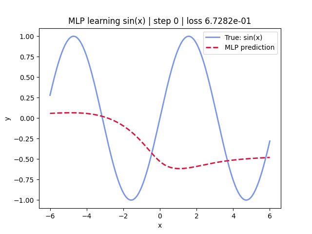

# MLPs-Universal-Approximators

A set of numerical experiments designed to empirically demonstrate the **Universal Approximation Theorem**, developed as a challenge for the Artificial Intelligence 1 course at Wrocław University of Science and Technology. The goal was to see how a Multi-Layer Perceptron (MLP) with a simple architecture can "learn" and approximate various continuous functions without ever being given the underlying mathematical formula.

### How it works

The experiments use a standard MLP built in **PyTorch** with two hidden layers (32 neurons each) and `Tanh` activations. The model is trained using the **Adam optimizer** and **MSE Loss** to fit discrete $(x, y)$ data points generated from several target functions.

We tested the model against six distinct behaviors to see how well it adapts:

- **Smooth/Periodic:** $\sin(x)$ and damped oscillations ($\cos(2x) \cdot e^{-x^2/4}$).
- **Non-linear growth:** $x^2 \cdot \sin(x)$.
- **Sharp transitions:** $\tanh(5x)$.
- **Non-differentiable:** $|x|$ (to test how it handles the "pointy" bit at the origin).
- **Discontinuous:** A sawtooth-like function, which serves as a "negative control" since the theorem specifically applies to continuous functions.

### Visualizing Convergence

The code includes a script to capture the training process as it happens. The animation below shows the neural network's prediction warping and eventually snapping to the true function as loss decreases.

<div align="center">

</div>

### Setup

To run the experiments yourself, make sure you have the dependencies installed:

```bash
pip install -r requirements.txt
```

### Implementation Details

Full implementation, experiments, and analysis are in [`multi_layer_perceptrons.ipynb`](multi_layer_perceptrons.ipynb).
